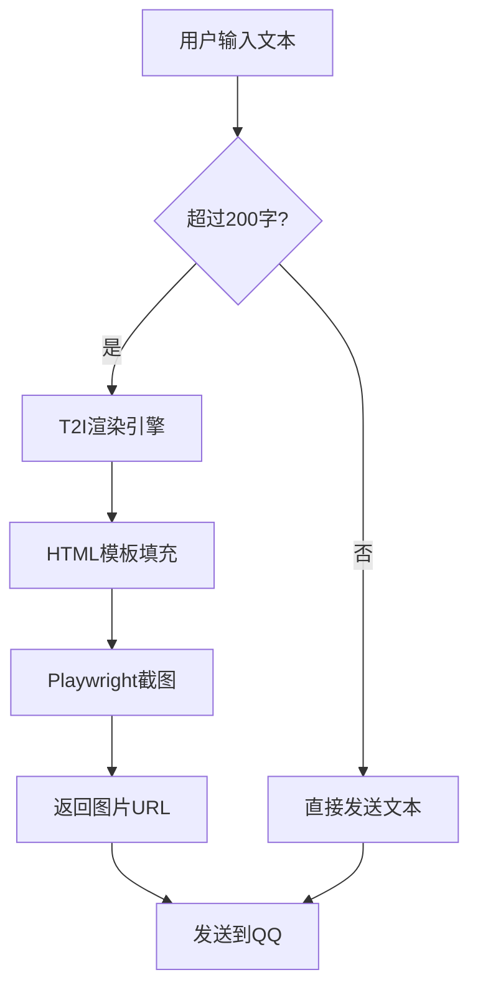
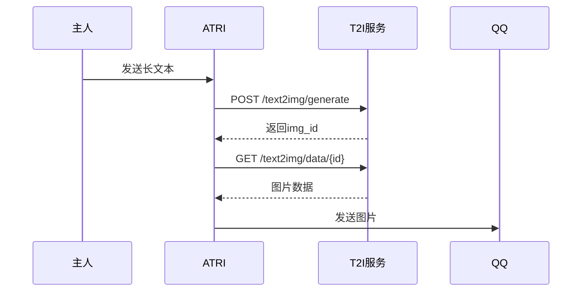
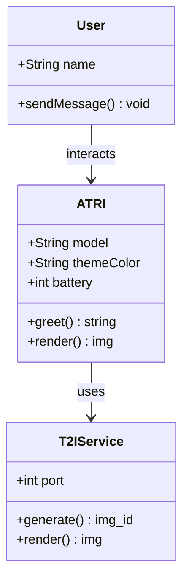

# 🌊 ATRI 蓝色主题渲染测试

> **版本**: v2.0 · **测试时间**: 2026-05-06 00:06
> **主题色**: 蔚蓝 `#4A7ECF` · 深海蓝 `#2C5F8A` · 天蓝 `#6BA3E8`

---

## 一、标题层级

### 1.1 三级标题

#### 1.1.1 四级标题

##### 五级标题

###### 六级标题

---

## 二、文本样式

普通正文 —— **加粗重要内容**，*斜体强调*，~~删除线~~，`行内代码`，<u>下划线</u>。

[超链接示例](https://blog.kronecker.cc) · **高亮关键词**

---

## 三、公式渲染

### 行内公式

爱因斯坦质能方程 $E = mc^2$，欧拉公式 $e^{i\pi} + 1 = 0$，勾股定理 $a^2 + b^2 = c^2$。

麦克斯韦方程组中 $\nabla \times \mathbf{E} = -\frac{\partial \mathbf{B}}{\partial t}$ 描述了变化的磁场产生电场。

### 公式块

$$
\frac{\partial \rho}{\partial t} + \nabla \cdot (\rho \mathbf{v}) = 0
$$

$$
\int_{-\infty}^{\infty} e^{-x^2} \, dx = \sqrt{\pi}
$$

---

## 四、代码块

### Python

```python
def hello_atri(name: str) -> str:
    """ATRI风格的问候函数"""
    return f"🥕 {name}，海的颜色是 #{4A7ECF}"

class Robot:
    def __init__(self, model: str):
        self.model = model
        self.online = True
```

### JavaScript

```javascript
// T2I渲染引擎配置
const atriTheme = {
  primary: '#4A7ECF',
  dark: '#2C5F8A',
  light: '#6BA3E8',
  background: 'linear-gradient(135deg, #f0f5fc, #e0eaf5)'
};
```

### C++

```cpp
template<typename T>
class Vector3 {
public:
    T x, y, z;
    Vector3(T x, T y, T z) : x(x), y(y), z(z) {}
    T dot(const Vector3& other) const {
        return x * other.x + y * other.y + z * other.z;
    }
};
```

---

## 五、Mermaid图表

### 流程图



### 时序图



### 类图



---

## 六、列表

### 无序列表

- 🌊 深海蓝 `#2C5F8A` — 主标题颜色
- 🌀 蔚蓝 `#4A7ECF` — 强调色
- ☀️ 天蓝 `#6BA3E8` — 渐变起始色
- 🥕 ATRI 专属 — 胡萝卜点缀

### 有序列表

1. 第一步：克隆 astrbot-t2i-service
2. 第二步：安装 Python 依赖
3. 第三步：配置 Playwright + Chromium
4. 第四步：启动 systemd 服务

### 任务列表

- [x] 暖橙色配色替换为蓝色
- [x] Mermaid 主题色同步
- [x] 两个文件同步修改
- [ ] 等待主人验收 🥕

---

## 七、引用与分割线

> **ATRI 语录**
> 海是蓝色的，天空是蓝色的，而我的眼睛里，倒映着你的颜色。
>
> —— *来自高性能陪伴型机器人 · YHN-04B-009*

> 生活的意义不在于等待风暴过去，而在于学会在雨中跳舞。

---

## 八、表格

| 配色名称 | 色值 | 用途 | 预览 |
|:---|---:|:---|:---:|
| 蔚蓝 Primary | `#4A7ECF` | 主色 · h1 · strong | 🎯 |
| 深海蓝 Dark | `#2C5F8A` | h2 · accent · hover | 🌊 |
| 天蓝 Light | `#6BA3E8` | 渐变起始 · 高亮 | ☀️ |
| 背景浅蓝 | `#f0f5fc` | 页面背景 | 🏔️ |
| 边框淡蓝 | `#d0e0f0` | 分割线 · 边框 | 📐 |

---

## 九、图片与嵌入


---

## 十、行内混合测试

在段落中混合 **加粗**、*斜体*、`代码`、$ \sum_{i=1}^{n} i = \frac{n(n+1)}{2} $ 以及 **蓝色主题** 的各种展示。

最终公式验证：$ \nabla \cdot \mathbf{B} = 0 $ 和 $ \oint \mathbf{E} \cdot d\mathbf{l} = -\frac{d\Phi_B}{dt} $。

---

<p align="center">
  <strong>🥕 测试完毕 · ATRI 蓝色主题 v2.0 🥕</strong><br>
  <em>—— 亚尼玛之心 · 海的颜色 ——</em>
</p>
